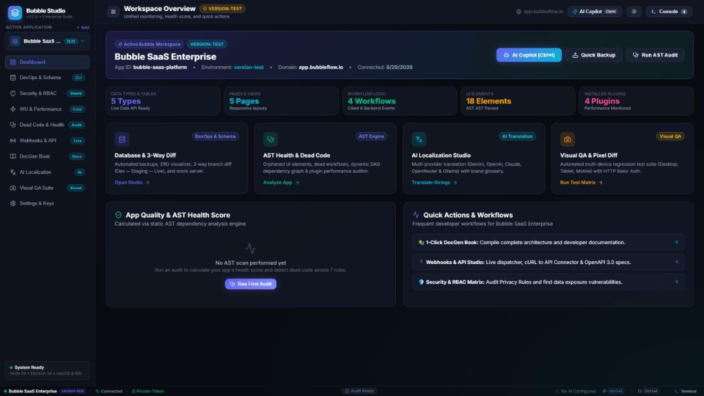
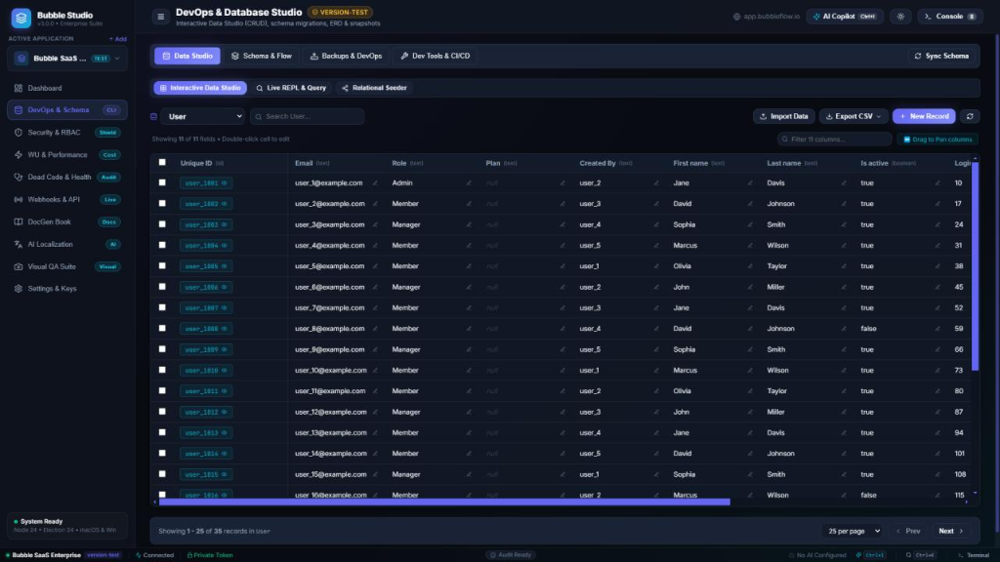
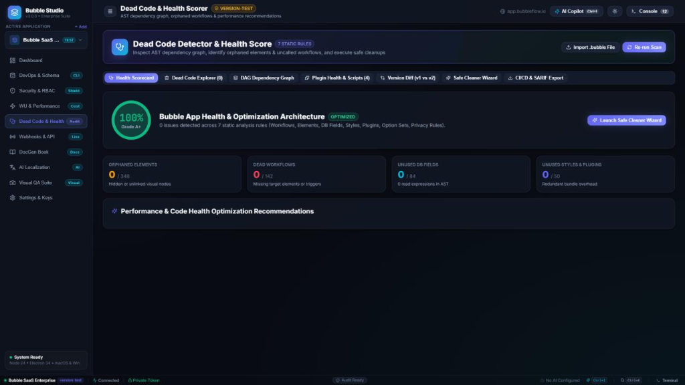
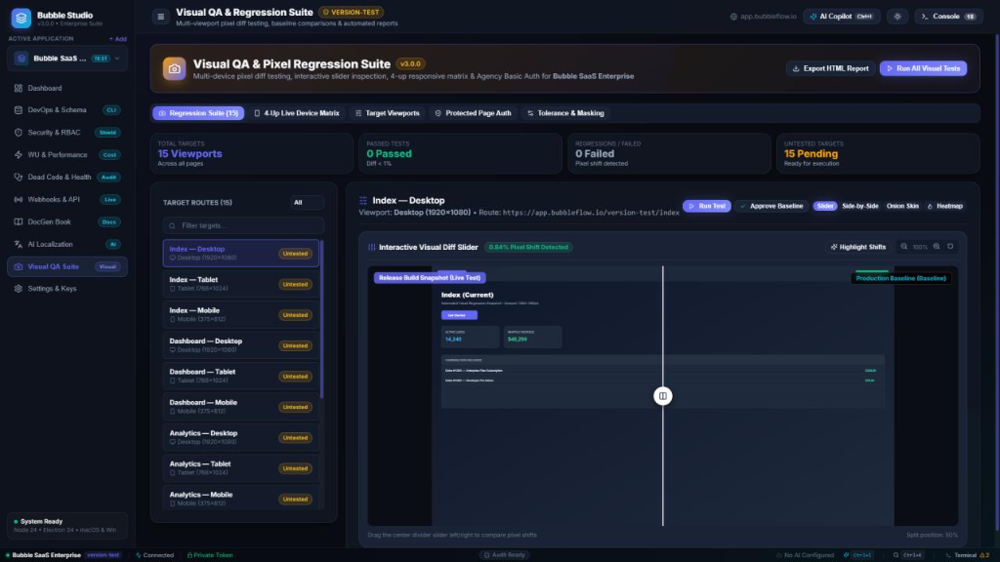
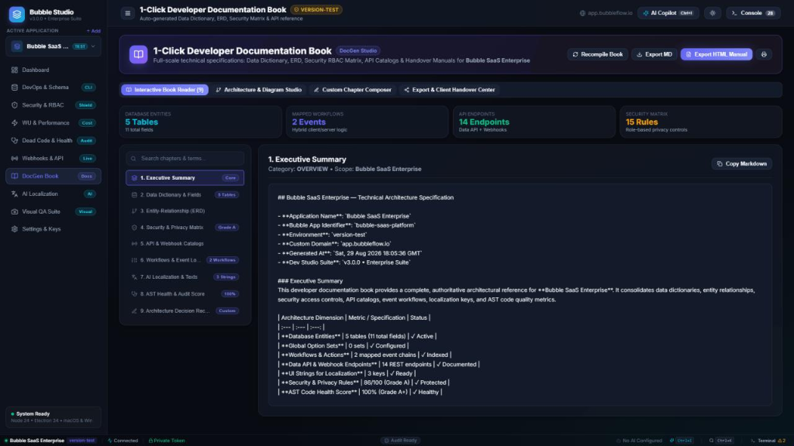
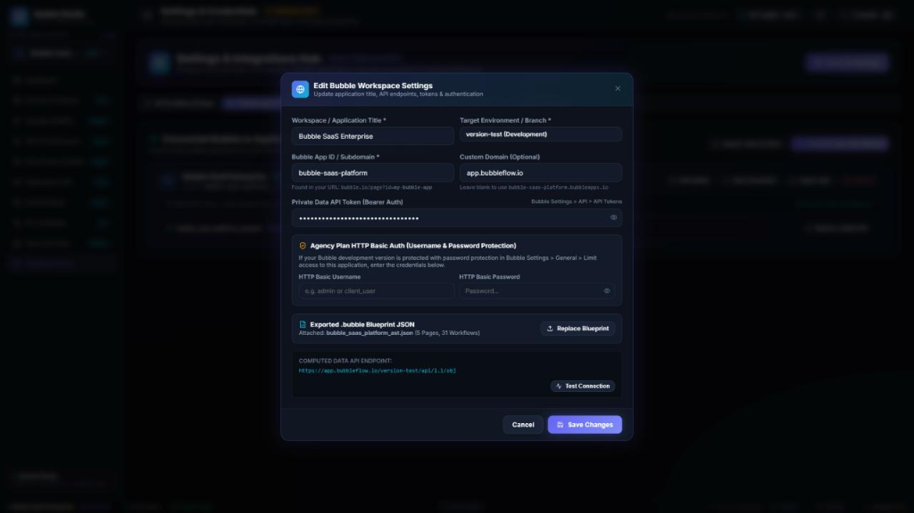

# Bubble.io Dev Studio

[]()
[](https://www.typescriptlang.org/)
[](https://www.electronjs.org/)
[](https://react.dev/)
[](https://vitejs.dev/)
[]()
[](https://opensource.org/licenses/MIT)

Bubble.io Dev Studio is a desktop IDE for Bubble.io developers, agencies, and QA teams. It brings together tools for live database management, workflow visualization, AI localization, visual regression testing, dead code detection, privacy rule audits, and documentation generation.

<p align="center">
  
</p>

---

## Interface Gallery

<details open>
<summary><strong>Expand interface showcase</strong></summary>
<br/>

| Workspace Overview Dashboard | DevOps & Database Studio (Live CRUD & REPL) |
| :---: | :---: |
|  |  |

| AST Dead Code Detector & Health Score | Visual QA & Pixel Regression Suite (Diff Slider) |
| :---: | :---: |
|  |  |

| 1-Click Developer Documentation Book (DocGen) | Workspace Settings & Authentication Hub |
| :---: | :---: |
|  |  |

</details>

---

## Download Desktop App (v3.7.0 Pre-Built Binaries)

Pre-built binaries for running the desktop app directly:

| Platform | Download Link (v3.7.0 Stable) | Package Format | Architecture |
| :--- | :--- | :--- | :--- |
| **Windows** | [Bubble.io-Dev-Studio-Setup-3.7.0.exe](https://github.com/alexandrmotologa/bubble-io-dev-studio/releases/download/v3.7.0/Bubble.io-Dev-Studio-Setup-3.7.0.exe) • [Portable .exe](https://github.com/alexandrmotologa/bubble-io-dev-studio/releases/download/v3.7.0/Bubble.io-Dev-Studio-3.7.0.exe) | NSIS Setup / Portable | x64 |
| **macOS** | [Bubble.io-Dev-Studio-3.7.0.dmg](https://github.com/alexandrmotologa/bubble-io-dev-studio/releases/download/v3.7.0/Bubble.io-Dev-Studio-3.7.0.dmg) • [.zip](https://github.com/alexandrmotologa/bubble-io-dev-studio/releases/download/v3.7.0/Bubble.io-Dev-Studio-3.7.0-mac.zip) | Apple Disk Image / ZIP | Apple Silicon (M1-M4) & Intel |
| **Linux** | [Bubble.io-Dev-Studio-3.7.0.AppImage](https://github.com/alexandrmotologa/bubble-io-dev-studio/releases/download/v3.7.0/Bubble.io-Dev-Studio-3.7.0.AppImage) | AppImage format | x64 |

> **Release Page**: [View v3.7.0 release notes on GitHub](https://github.com/alexandrmotologa/bubble-io-dev-studio/releases/tag/v3.7.0) | [Latest Release](https://github.com/alexandrmotologa/bubble-io-dev-studio/releases/latest)
>
> **Windows Installation Note**: Because this open-source build does not carry a paid EV code-signing certificate, Windows SmartScreen may display "Windows protected your PC". Click **More info** and select **Run anyway** to launch the installer.

---

## Table of Contents
- [Download Desktop App](#download-desktop-app-v339-pre-built-binaries)
- [Architecture & Modules Overview](#architecture--modules-overview)
- [Blueprint Synchronization Options](#blueprint-synchronization-options)
- [Quick Start Guide](#quick-start-guide)
- [Core Features](#core-features)
  - [1. Cloud Direct Sync](#1-cloud-direct-sync)
  - [2. Database Studio & DevOps](#2-database-studio--devops)
  - [3. Workflow Logic Visualizer](#3-workflow-logic-visualizer)
  - [4. Security & Privacy Rules Auditor](#4-security--privacy-rules-auditor)
  - [5. Workload Units (WU) Profiler](#5-workload-units-wu-profiler)
  - [6. AST Dead Code Detector](#6-ast-dead-code-detector)
  - [7. AI Localization Studio](#7-ai-localization-studio)
  - [8. Visual QA & Viewport Testing](#8-visual-qa--viewport-testing)
  - [9. Webhooks, cURL & Plugin SDK Generator](#9-webhooks-curl--plugin-sdk-generator)
  - [10. Documentation Generator (DocGen)](#10-documentation-generator-docgen)
  - [11. Application Updates & Local Storage](#11-application-updates--local-storage)
- [Global Keyboard Shortcuts](#global-keyboard-shortcuts)
- [Documentation Guides (`docs/`)](#documentation-guides-docs)
- [Tech Stack](#tech-stack)
- [Local Development & Build](#local-development--build)
- [License & Credits](#license--credits)

---

## Architecture & Modules Overview

```
┌─────────────────────────────────────────────────────────────────────────────────────────────────┐
│                                   Bubble.io Dev Studio                                          │
├───────────────────┬───────────────────┬───────────────────┬───────────────────┬─────────────────┤
│ DevOps & Data     │ Workflow Nodes    │ Security & RBAC   │ WU Cost Profiler  │ Dead Code AST   │
│   • Data Studio   │   • Flowchart Map │   • RBAC Matrix   │   • Search Audit  │   • DAG Tree    │
│   • ERD & Types   │   • Blocking Check│   • Role Sandbox  │   • Monthly Cost  │   • Health %    │
│   • Snapshots DB  │   • Mermaid Export│   • Public Scanner│   • N+1 Loop Check│   • Safe Purge  │
│   • CI/CD Presets │   • Step Drawer   │   • SARIF Reports │   • Optimizer     │   • Manifest    │
├───────────────────┼───────────────────┼───────────────────┼───────────────────┼─────────────────┤
│ AI Translation    │ Visual QA         │ Webhooks & SDK    │ DocGen Book       │ Cloud Sync      │
│   • 9 AI Models   │   • Pixel Diff    │   • Webhook Logs  │   • Data Dict     │   • Direct Sync │
│   • Memory Cache  │   • Basic Auth    │   • cURL to Bubble│   • Markdown/HTML │   • Downloads   │
│   • Bubble CSV    │   • Viewports     │   • Plugin Action │   • PDF Print     │   • Auto-Watcher│
└───────────────────┴───────────────────┴───────────────────┴───────────────────┴─────────────────┘
```

---

## Blueprint Synchronization Options

Bubble.io Dev Studio supports three ways to import your application structure (UI elements, workflows, pages, and database schemas) into the local workspace:

| Method | Mechanism | Prerequisites | Setup | Target Use Case |
| :--- | :--- | :--- | :---: | :--- |
| **Cloud Direct Sync** | Cloud service fetches the app export through a collaborator account (`bubbledevstudio.bot@gmail.com`). | Invite bot under Bubble *Settings > Collaboration*. | ~30 seconds | Fast sync from inside the desktop app. |
| **Downloads Watcher** | Background watcher monitors the local `~/Downloads` folder. | None. Click *Export application* in Bubble *Settings > General*. | None | Automatic import when exporting from your browser. |
| **Manual File Import** | Drag-and-drop file upload. | Existing `.bubble` or `.json` file on disk. | None | Offline environments or reviewing past versions. |

For technical details, see the [Cloud Direct Sync Guide](docs/cloud-sync-guide.md).

---

## Quick Start Guide

### Step 1: Connect your Bubble application
1. Launch **Bubble.io Dev Studio**.
2. Click **Connect Application** (or press `Ctrl+N` / `Cmd+N`) to open the connection wizard:
   - **App Identity**: Enter your application name, Bubble App ID (or editor URL), target environment (`version-test` or `version-live`), and optional custom domain. The wizard runs a reachability check.
   - **Authentication & Security**: Enter your Private API Bearer Token from Bubble (*Settings > API > Generate new API token*). Enable Data API access, automated backups, and privacy checks as needed.
   - **AI Model & Localization**: Choose an AI provider (Ollama for local offline use, or Google Gemini, OpenAI, Claude, Groq, DeepSeek, xAI). Test the connection to verify your credentials.
   - **Application Blueprint**: Choose your sync method:
     - Use **Cloud Sync** after inviting `bubbledevstudio.bot@gmail.com` under Bubble *Settings > Collaboration*.
     - Or click **Export application** in Bubble *Settings > General* to let the Downloads watcher pick it up.
     - Or drag and drop an existing `.bubble` file into the dropzone.
   - **Verification**: Review the checklist and launch your workspace.

### Step 2: Manage live data in Data Studio
1. Open **DevOps & Database Studio > Data Studio**.
2. Browse records in a table grid.
3. Double-click any cell to edit (`PATCH`), use the CSV/JSON batch importer, or seed relational data using `@alias` foreign keys.

### Step 3: Run security and privacy audits
1. Open **Security & RBAC Auditor**.
2. Check the **Role-Based Access Control (RBAC) Matrix** to find unauthenticated table exposures.
3. Switch personas in the **Role Access Simulator** (*Guest*, *Owner*, *Admin*) to view field masking.
4. Copy Bubble privacy expressions directly or export a **SARIF 2.1.0 JSON** report for CodeQL.

### Step 4: Detect dead code and optimize workload units
1. Open **AST Dead Code Detector** to check your application health score (0-100%).
2. Review unreferenced visual elements and unused custom events, then generate cleanup manifests.
3. Open **WU Cost Profiler** to find unconstrained searches and N+1 repeating group loops.

---

## Core Features

### 1. Cloud Direct Sync
* **Service Architecture**: Node.js service running on private cloud infrastructure.
* **Export Protocol**: Retrieves application definitions from `https://bubble.io/appeditor/export/${branch}/${appId}.bubble`, covering pages, workflows, UI elements, and data models.
* **File Storage**: Saves compact JSON directly to `~/Downloads/[appId]-cloud-sync.bubble` (~10.8 MB), matching Bubble's official export file format.
* **Data Privacy**: The sync service only reads application structure (the AST). It does not query or read database records. Bot credentials are kept in a private `.env` file with rate limiting (30 requests per 15 minutes).

### 2. Database Studio & DevOps
* **Live Grid**: CRUD explorer, inline cell editing (`PATCH`), record drawer, sorting, and JSON/CSV exports.
* **Batch Importer**: Import CSV and JSON files with automatic column mapping, type casting, and progress tracking.
* **Relational Data Seeder**: Seed multi-table records using `_ref: "@alias"` references with topological sorting and circular link resolution.
* **1-Click Database Migration Generator**: Export your Bubble schema directly to:
  - **Supabase SQL**: Enables `uuid-ossp` and `pgcrypto`, configures Row Level Security (`ENABLE ROW LEVEL SECURITY;`) with starter authenticated policies, automated `handle_updated_at()` triggers, Option Sets as PostgreSQL `ENUM`, and deferred foreign key constraints.
  - **PostgreSQL**: Transactional DDL (`BEGIN; ... COMMIT;`) with custom enums, type conversions (`geographic address` to `JSONB`, lists to `JSONB DEFAULT '[]'::jsonb`), and B-tree indexes on foreign keys and creation dates.
  - **Prisma ORM**: Complete `schema.prisma` definitions with model attributes, relations, and Option Sets as enums.
* **Interactive ERD & High-Res Graphic Export**: Entity-relationship diagrams with pan and zoom. Export options include Vector SVG, High-Res PNG (2x Retina & 3x Ultra-DPI), and direct PNG copying to the system clipboard for pasting into Notion or Slack.
* **TypeScript & Zod Studio**: Generate `.d.ts` definitions, Zod validation schemas, and a typed Bubble API client SDK.
* **Backups**: Run full or table-specific backups with SHA-256 checksums, encryption, and JSON archive restore.
* **Database Snapshots**: Save table states before running large operations, compare changes, and export diffs in Markdown or JSON.
* **Cross-Environment Sync**: Compare schemas between `version-test` and `live` to detect schema drift before releases.
* **CI/CD Pipelines**: Export workflow configurations for GitHub Actions and GitLab CI.

### 3. Workflow Logic Visualizer
* **Node Graphs**: Visualizes workflow chains with color-coded node types (triggers, database writes, emails, API calls, navigation).
* **Conditional Branch Inspector**: Shows `"Only when..."` constraints on workflows and actions.
* **Action Drawer**: Inspects individual action properties, parameters, and expressions.
* **Performance Advisor**: Flags client-blocking actions, such as synchronous frontend email sending, and suggests backend scheduling.
* **Mermaid & Graphic Export**: Export flowcharts to Mermaid syntax, Vector SVG, or High-Res PNG.

### 4. Security & Privacy Rules Auditor
* **RBAC Matrix**: Maps permissions across Admin, Authenticated User, and Guest tiers.
* **Role Access Simulator**: Persona switcher (*Guest*, *Logged-in User*, *Record Owner*, *System Admin*) with visual field states (Visible, Masked, Redacted).
* **Public Risk Scanner**: Checks `/api/1.1/obj/` endpoints for unauthenticated data scraping risks and flags critical exposures.
* **Plugin Security & Deprecation Scanner**: Audits installed marketplace and custom plugins directly from the `.bubble` AST blueprint:
  - Flags unmaintained plugins with no updates for over 2 years (>730 days).
  - Detects legacy Bubble Plugin API v1 and v2 runtimes scheduled for deprecation.
  - Scans for exposed secret tokens in client properties: Stripe keys (`sk_live_`, `sk_test_`), AWS access keys (`AKIA...`), GitHub personal access tokens, Slack bot tokens, and private JWTs.
  - Identifies insecure `http://` scripts and measures the First Contentful Paint latency of render-blocking scripts in `<head>`.
  - Generates executive Markdown and SARIF 2.1.0 security reports.
* **Privacy Rules Generator**: Generates rules and expressions for the Bubble Data > Privacy editor.
* **Compliance Checks**: Evaluates privacy configuration against GDPR (Articles 5 & 32), SOC 2 Type II, PCI-DSS, and HIPAA guidelines.
* **Reports**: Exports audit summaries in Markdown and SARIF 2.1.0 JSON for CI/CD security scanners.

### 5. Workload Units (WU) Profiler
* **Monthly Cost Estimator**: Estimates monthly Workload Units based on data complexity and user operations.
* **Unconstrained Search Detection**: Identifies `Do a search for` queries that lack server-side constraints.
* **Client vs Server Ratio**: Highlights heavy client operations that could run more efficiently on backend workers.

### 6. AST Dead Code Detector
* **Health Score**: Computes an overall score (0-100%) and letter grade (A+ to F).
* **AST Scanner**: Inspects nested groups, popups, repeating groups, workflows, custom events, styles, and plugins.
* **DAG Dependency Graph**: Displays relational dependencies between visual elements and workflows.
* **Cleanup Assistant**: Generates cleanup manifests for unreferenced elements.

### 7. AI Localization Studio
* **String Extraction**: Extracts UI text, placeholders, button labels, tooltips, Option Sets, and alerts from `.bubble` files.
* **CSV Merge**: Merges external translation CSVs into the active workspace without modifying the original `.bubble` blueprint.
* **Sync Button**: Reloads original Option Sets and strings from the project blueprint at any time.
* **Matrix Translation**: Batch translates strings across multiple target languages simultaneously.
* **Supported AI Providers**: Google Gemini, OpenAI (GPT-4o, o3-mini), Anthropic Claude (3.7, 3.5), DeepSeek (V3, R1), Groq, xAI (Grok 2), OpenCode, OpenRouter, and local Ollama.
* **Translation Memory & Glossary**: Caches translations using hash keys in IndexedDB to avoid repeated calls, with token protection for Bubble dynamic values (`[Current User]`).

### 8. Visual QA & Viewport Testing
* **Device Matrix**: Test across Desktop (1920x1080), Laptop (1440x900), Tablet (768x1024), and Mobile (375x812).
* **Pixel Regression**: Compares screenshots pixel-by-pixel with pass/fail threshold indicators.
* **Inspection Modes**: Split-screen slider, side-by-side comparison, onion skin overlay (0-100% opacity), and heatmap highlighting.
* **HTTP Basic Auth**: Injects credentials for password-protected Bubble development applications.

### 9. Webhooks, cURL & API Studio
* **Local Webhook Mock Server (Port 4040)**: Starts an embedded local HTTP listener in Electron with CORS support to capture test webhooks from Stripe, SendGrid, WhatsApp, and Shopify in real time. Inspect headers, query params, and raw JSON, or retransmit payloads directly to your Bubble backend workflows with one click.
* **Webhook Inspector & Dispatcher**: Inspects incoming HTTP payloads, query parameters, and response status codes with offline simulation presets.
* **cURL to API Connector**: Converts curl commands into Bubble API Connector parameters and headers.
* **Plugin SDK Generator**: Generates boilerplate for Server-Side Actions (SSA), Client-Side Actions (CSA), TypeScript definitions, and `package.json`.

### 10. Documentation Generator (DocGen)
* **Two Documentation Modes**: Switch between an architectural narrative book and a structured data dictionary.
* **Reader View**: In-app formatted preview with an option to view raw Markdown.
* **Per-Chapter AI Generation**: Re-generate individual chapters with custom prompts (such as emphasizing GDPR compliance or webhook handling).
* **High-Res Diagram Exports**: Architecture context models, ERD entity graphs, and sequence diagrams exportable to Vector SVG or High-Res PNG.
* **Export Options**: Export to Markdown (`.md`), standalone HTML with embedded diagrams, JSON architecture specifications, or PDF.

### 11. Application Updates & Local Storage
* **Auto-Updates**: Uses `electron-updater` connected to GitHub Releases (`alexandrmotologa/bubble-io-dev-studio`).
* **Download Tracking**: Shows download speed and progress.
* **Restart Prompts**: Offers options to restart immediately or postpone until later.
* **Data Separation**: Application binaries reside in `%LOCALAPPDATA%\Programs\bubble-io-dev-studio\`, while projects, credentials, snapshots, and IndexedDB data stay in `%APPDATA%\bubble-io-dev-studio\` so updates do not overwrite your settings.

---

## Global Keyboard Shortcuts

| Shortcut | Action |
| :--- | :--- |
| `Ctrl + K` / `Cmd + K` | Global Command Palette (navigation, actions, project switcher) |
| `Ctrl + I` / `Cmd + I` | Bubble AI Copilot (natural language queries and regex generator) |
| `Ctrl + B` / `Cmd + B` | Run quick database backup |
| `Ctrl + \`` | Toggle log console drawer |

---

## Documentation Guides (`docs/`)

Technical guides are available in the [`docs/`](docs/) directory:

- [Cloud Direct Sync Guide](docs/cloud-sync-guide.md)
- [System Architecture & Storage Specifications](docs/architecture.md)
- [DevOps & Database Studio Guide](docs/devops-guide.md)
- [Workflow Flowchart & Logic Visualizer Guide](docs/workflows-guide.md)
- [Security & Privacy Rules Auditor Guide](docs/security-guide.md)
- [Workload Units (WU) Profiler Guide](docs/wu-profiler-guide.md)
- [AI Localization Studio Guide](docs/ai-localization-guide.md)
- [Webhooks & API Studio Guide](docs/api-studio-guide.md)
- [Visual QA Suite Guide](docs/visual-qa-guide.md)
- [DocGen Developer Book Guide](docs/docgen-guide.md)
- [Settings & Integrations Hub Guide](docs/settings-guide.md)

---

## Tech Stack

* **Desktop Shell**: [Electron 34](https://www.electronjs.org/) and TypeScript 5.7
* **Frontend**: [React 18](https://react.dev/) and [Vite 6](https://vitejs.dev/)
* **Styling**: Vanilla CSS variables with custom dark and light themes
* **Diagrams & Icons**: [Mermaid.js](https://mermaid.js.org/) and [Lucide Icons](https://lucide.dev/)
* **Local Persistence**: IndexedDB (backups, snapshots, translation memory) and LocalStorage (workspace settings)
* **Cloud Sync Service**: Node.js 20+ Express microservice
* **Distribution**: `electron-updater` with GitHub Releases

---

## Local Development & Build

### Prerequisites
* **Node.js**: `v20.0.0` or higher
* **npm**: `v10.0.0` or higher

### Local Development
```bash
# 1. Clone repository
git clone https://github.com/alexandrmotologa/bubble-io-dev-studio.git
cd bubble-io-dev-studio

# 2. Install dependencies
npm install

# 3. Start Vite dev server and Electron shell
npm run dev
```

### Type Checking & Production Build
```bash
# Run TypeScript compilation check
npm run typecheck

# Build Vite bundle
npm run build:vite

# Package Windows desktop installer
npm run dist:win
```

---

## License & Credits

Distributed under the **MIT License**. See [LICENSE](LICENSE) for details.

<p align="center">
  <b>Bubble.io Dev Studio</b> by <b><a href="https://mtlg.site">Alexandr Motologa</a></b> | <b><a href="https://mtlglabs.space">MTLG Labs</a></b>
</p>
<p align="center">
  <a href="https://mtlglabs.space">MTLG Labs</a> • 
  <a href="https://mtlg.site">Portfolio</a> • 
  <a href="https://github.com/alexandrmotologa">GitHub</a>
</p>
