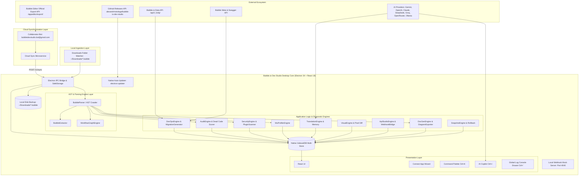

# System Architecture & Technical Specifications

This document covers the internal architecture, data flow, storage strategies, and synchronization options in Bubble.io Dev Studio.

---

## 1. System Topology & Data Flow

---

## 2. Blueprint Ingestion Pathways

Dev Studio supports three synchronization methods to import application blueprints:

| Pathway | Mechanism | Target User | Network Flow |
| :--- | :--- | :--- | :--- |
| **Cloud Direct Sync** | Dedicated cloud service using a collaborator account (`bubbledevstudio.bot@gmail.com`). | Teams on Bubble plans with collaborator support. | `Bubble Export -> Cloud Service -> Desktop App` |
| **Downloads Watcher** | Local background watcher listening to the user's `~/Downloads` folder. | Users exporting manually from the browser. | `Browser Download -> File Watcher -> Desktop App` |
| **Manual File Import** | File picker or drag-and-drop zone accepting `.bubble` or `.json` files. | Offline environments and archive reviews. | `File Upload -> Desktop App` |

---

## 3. IndexedDB Storage Architecture

The app uses an asynchronous IndexedDB layer (`IndexedDbStore`, `DB_VERSION = 4`) to store blueprints, backups, and snapshots without local storage size limits:

| Object Store | Key Path | Payload Description | Purpose |
| :--- | :--- | :--- | :--- |
| `settings` | `key` | Global preferences, active project ID, AI credentials, UI theme | Preserves settings across sessions |
| `blueprints` | `projectId` | Complete `.bubble` JSON export | Offline AST analysis |
| `translations` | `key` | Translation Memory cache (`hash(sourceText + targetLang)`) and glossary | Prevents repeated translation calls |
| `backups` | `backupId` | Table JSON dumps, schemas, and row metadata | Restores and rollback points |
| `visual_baselines` | `caseId` | Reference screenshots and element coordinates | Visual diff comparisons |
| `snapshots` | `id` | Point-in-time table record arrays with metadata | Rollback and difference auditing |
| `doc_books` | `appName` | Generated documentation chapters and Markdown | Architecture and API documentation |

---

## 4. Data Persistence Across Application Updates

Updating the application does not overwrite user workspaces, database snapshots, or saved credentials.

### Separation of Binaries and User Data:
* **Application Binaries (Replaced during updates)**:
  - Windows: `%LOCALAPPDATA%\Programs\bubble-io-dev-studio\`
  - macOS: `/Applications/Bubble.io Dev Studio.app/`
  - Linux: AppImage or `/opt/`
* **Persistent User Data (Retained during updates)**:
  - Windows: `%APPDATA%\bubble-io-dev-studio\`
  - macOS: `~/Library/Application Support/bubble-io-dev-studio/`
  - Linux: `~/.config/bubble-io-dev-studio/`

This user profile directory stores:
1. All **IndexedDB databases** (`blueprints`, `backups`, `snapshots`, `translations`).
2. LocalStorage settings (project configurations and window sizes).
3. Credentials encrypted through native OS keyrings (DPAPI on Windows, Keychain on macOS, Secret Service on Linux).

When `autoUpdater.quitAndInstall(false, true)` runs:
1. The installer replaces the executable files in the program directory.
2. The user profile directory remains untouched.
3. The app relaunches with all existing projects, snapshots, and tokens intact.

---

## 5. AST Parsing & Extraction

Bubble exports application definitions in nested JSON. The AST parser (`src/core/audit/bubbleParser.ts` and `src/core/translator/bubbleExtractor.ts`) uses depth-first tree traversal:

1. **Elements Tree**: Traverses `pages.<pageName>.elements` and nested containers (`Group`, `Popup`, `RepeatingGroup`, `FloatingGroup`, `ReusableElement`).
2. **Workflows & Actions**: Traverses page workflows, custom events, and backend API workflows (`workflows`, `api_workflows`, `backend_workflows`).
3. **Database Types & Option Sets**: Parses custom data types (`user_types`, `custom_types`, `database_types`) and static Option Sets (`option_sets`, `custom_options`).
4. **Security Rules**: Parses access rules (`user_types.<type>.privacy_rules`) and checks for unauthenticated backend triggers.

---

## 6. Supported AI Providers

The AI Gateway (`src/core/ai/aiProviders.ts` and `src/core/translator/translationEngine.ts`) supports:

- **Google Gemini**: `gemini-2.0-flash`, `gemini-1.5-pro`, `gemini-1.5-flash`
- **OpenAI**: `gpt-4o`, `gpt-4o-mini`, `o1-preview`, `o3-mini`
- **Anthropic Claude**: `claude-3-7-sonnet`, `claude-3-5-sonnet`, `claude-3-5-haiku`
- **DeepSeek**: `deepseek-chat` (V3), `deepseek-reasoner` (R1)
- **Groq**: `llama-3.3-70b-versatile`, `deepseek-r1-distill-llama-70b`, `mixtral-8x7b-32768`
- **OpenRouter**: Access to open-source and proprietary models
- **Ollama**: Local model execution (`llama3:8b`, `mistral`, `qwen2.5`) with automatic model discovery via `http://localhost:11434/api/tags`.

---

## 7. Electron Security & Preview Settings

* **Frame-Ancestors & CSP Modification**:
  `session.defaultSession.webRequest.onHeadersReceived` strips `X-Frame-Options` and `Content-Security-Policy: frame-ancestors` headers to allow embedded preview frames of Bubble applications.
* **Basic Authentication**:
  `app.on('login')` handles HTTP Basic Auth credentials for password-protected development environments.
* **Credential Encryption**:
  API tokens and database keys are encrypted before storage using `safeStorage.encryptString()`.

---

## 8. Local Webhook Mock Server Architecture

Dev Studio includes an embedded Node HTTP server in the Electron main process for webhook debugging:

* **Port Binding**: Listens on `http://127.0.0.1:4040` by default, configurable through the API Studio interface.
* **CORS & Preflight**: Handles `OPTIONS` preflight requests automatically with wildcard CORS headers (`*`), accepting payloads from local tools, ngrok tunnels, or browser fetch calls.
* **Body Stream Parsing**: Collects incoming HTTP chunks up to 10 MB, parses JSON bodies when valid, and preserves raw text for signature verification.
* **IPC Broadcast**: Dispatches captured events to renderer windows via `mainWindow.webContents.send('webhook:received', payload)` for live inspection.
* **Bubble Forwarding**: Forwards inspected payloads directly to Bubble backend workflows with custom headers and authorization tokens.
