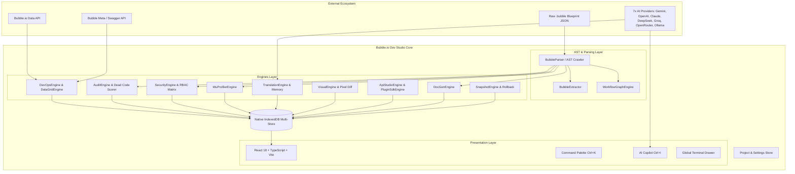

# 🏛️ Bubble.io Dev Studio — Architecture & Technical Specifications

This document outlines the internal architecture, data flow, storage strategies, and engineering design patterns powering **Bubble.io Dev Studio**.

---

## 1. System Topology & Data Flow

---

## 2. Multi-Store IndexedDB Persistence Architecture

To eliminate browser `localStorage` 5MB quota restrictions and ensure enterprise data safety, the studio operates an asynchronous Promise-based IndexedDB storage layer (`IndexedDbStore` with `DB_VERSION = 4`):

| Object Store | Key Path | Payload Description | Purpose |
| :--- | :--- | :--- | :--- |
| `settings` | `key` | Global preferences, active project ID, AI credentials, UI themes | Settings persistence across restarts |
| `blueprints` | `projectId` | Complete `.bubble` JSON blueprint exports (up to 50MB+) | Offline AST analysis, zero re-upload |
| `translations` | `key` | Translation Memory cache (`hash(sourceText + targetLang)`) and Glossary | Deduplication, token cost savings |
| `backups` | `backupId` | Full table JSON dumps, schema snapshots, and row metadata | Disaster recovery and sandbox imports |
| `visual_baselines` | `caseId` | High-res Canvas raster screenshots and element coordinates | Pixel regression visual diff comparisons |
| `snapshots` | `id` | Point-in-time table record arrays with metadata | 1-Click Rollback and differential auditing |
| `doc_books` | `appName` | Compiled Technical Architecture Books & chapter Markdown | 1-Click Documentation generation |

---

## 3. AST Parsing & Deep Extraction

Bubble exports applications in nested JSON format. The AST parser (`src/core/audit/bubbleParser.ts` and `src/core/translator/bubbleExtractor.ts`) utilizes recursive depth-first tree traversal:

1. **Elements Tree**: Traverses `pages.<pageName>.elements` and nested containers (`Group`, `Popup`, `RepeatingGroup`, `FloatingGroup`, `ReusableElement`).
2. **Workflows & Actions**: Traverses page-level workflows, custom events, and backend API workflows (`workflows`, `api_workflows`, `backend_workflows`).
3. **Database Types & Option Sets**: Parses custom data types (`user_types`, `custom_types`, `database_types`) and static Option Sets (`option_sets`, `custom_options`).
4. **Security & Privacy Rules**: Extracts type-level access rules (`user_types.<type>.privacy_rules`) and identifies unauthenticated backend triggers.

---

## 4. Multi-Provider AI Architecture

The studio implements a unified AI Gateway (`src/core/ai/aiProviders.ts` and `src/core/translator/translationEngine.ts`) supporting 7 industry-leading LLM providers:

- **Google Gemini**: `gemini-2.0-flash`, `gemini-1.5-pro`, `gemini-1.5-flash`
- **OpenAI**: `gpt-4o`, `gpt-4o-mini`, `o1-preview`, `o3-mini`
- **Anthropic Claude**: `claude-3-7-sonnet`, `claude-3-5-sonnet`, `claude-3-5-haiku`
- **DeepSeek**: `deepseek-chat` (DeepSeek V3), `deepseek-reasoner` (DeepSeek R1)
- **Groq**: Ultra-low-latency `llama-3.3-70b-versatile`, `deepseek-r1-distill-llama-70b`, `mixtral-8x7b-32768`
- **OpenRouter**: Access to 100+ open and proprietary models
- **Ollama**: 100% private, local on-premise execution (`llama3`, `mistral`, `qwen2.5`)

---

## 5. Electron vs Browser Hybrid Runtime

The studio operates both as a web application and a native desktop Electron application:

* **In Electron Desktop**:
  - `session.defaultSession.webRequest.onHeadersReceived` intercepts response headers and strips `X-Frame-Options` and `Content-Security-Policy: frame-ancestors` to allow live embedded previews of all Bubble applications without editor modifications.
  - Native `app.on('login')` intercepts and authenticates HTTP Basic Auth credentials for Agency Plan protected applications.
* **In Web Browser**:
  - Full sandbox support with fallback URL synchronization and direct cross-origin guidance.
