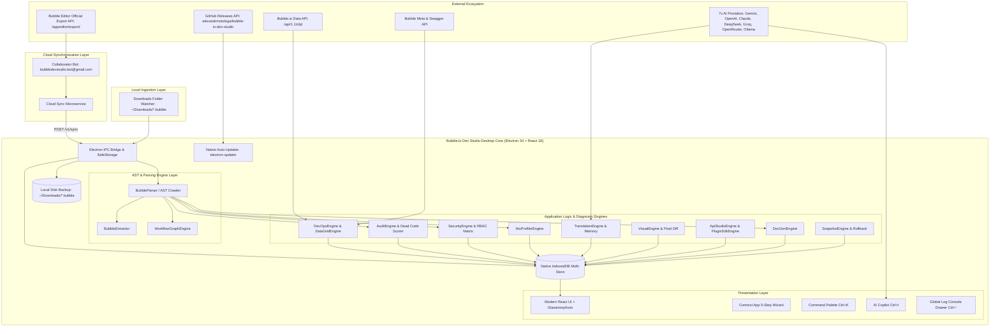

# 🏛️ Bubble.io Dev Studio — Architecture & Technical Specifications (v3.3.8)

This document outlines the internal architecture, data flow, storage strategies, synchronization pathways, and engineering design patterns powering **Bubble.io Dev Studio**.

---

## 1. System Topology & Data Flow

---

## 2. The 3 Application Blueprint Ingestion Pathways

To provide unmatched flexibility regardless of the developer's Bubble hosting tier, Dev Studio supports **3 distinct synchronization pathways**:

| Pathway | Mechanism | Target User | Network Flow |
| :--- | :--- | :--- | :--- |
| **⚡ 1-Click Cloud Direct Sync** | Dedicated Cloud Sync microservice via collaborator bot (`bubbledevstudio.bot@gmail.com`). | Teams on Paid Bubble Plans wanting 1-click cloud sync. | `Bubble Official Export ➔ Cloud Microservice ➔ Desktop App` |
| **📁 Downloads Auto-Watcher** | Background file watcher listening to OS `~/Downloads` directory. | Zero-setup users using manual *"Export application"*. | `Browser Download ➔ Local File Watcher ➔ Desktop App` |
| **📄 Manual File Import** | Native file dropzone accepting `.bubble` or `.json` files. | Offline environments or archival review. | `Drag-and-Drop ➔ Desktop App` |

---

## 3. Multi-Store IndexedDB Persistence Architecture

To eliminate browser `localStorage` 5MB quota restrictions and ensure enterprise data safety, the studio operates an asynchronous Promise-based IndexedDB storage layer (`IndexedDbStore` with `DB_VERSION = 4`):

| Object Store | Key Path | Payload Description | Purpose |
| :--- | :--- | :--- | :--- |
| `settings` | `key` | Global preferences, active project ID, AI credentials, UI themes | Settings persistence across app sessions |
| `blueprints` | `projectId` | Complete `.bubble` JSON blueprint exports (up to 50MB+) | Offline AST analysis, zero re-upload |
| `translations` | `key` | Translation Memory cache (`hash(sourceText + targetLang)`) and Glossary | Deduplication, token cost savings |
| `backups` | `backupId` | Full table JSON dumps, schema snapshots, and row metadata | Disaster recovery and sandbox imports |
| `visual_baselines` | `caseId` | High-res Canvas raster screenshots and element coordinates | Pixel regression visual diff comparisons |
| `snapshots` | `id` | Point-in-time table record arrays with metadata | 1-Click Rollback and differential auditing |
| `doc_books` | `appName` | Compiled Technical Architecture Books & chapter Markdown | 1-Click Documentation generation |

---

## 4. Zero Data Loss Architecture Across Application Updates

A critical architectural guarantee of Bubble.io Dev Studio is that **updating the application will NEVER wipe or alter existing user projects, databases, or credentials**.

### Separation of Binaries and User Data:
* **Executable Binaries (Replaced during update)**:
  - Windows: `%LOCALAPPDATA%\Programs\bubble-io-dev-studio\`
  - macOS: `/Applications/Bubble.io Dev Studio.app/`
  - Linux: Application AppImage or `/opt/`
* **Persistent User Data (Untouched during update)**:
  - Windows: `%APPDATA%\bubble-io-dev-studio\`
  - macOS: `~/Library/Application Support/bubble-io-dev-studio/`
  - Linux: `~/.config/bubble-io-dev-studio/`

This directory houses the Chromium profile containing:
1. All **IndexedDB databases** (`blueprints`, `backups`, `snapshots`, `translations`).
2. LocalStorage settings (`projects`, active workspace ID, window bounds).
3. Securely encrypted credentials via native OS keyring (DPAPI on Windows, Keychain on macOS, Secret Service on Linux).

When `autoUpdater.quitAndInstall(false, true)` executes:
1. The NSIS installer silently patches only the executable files in `%LOCALAPPDATA%`.
2. The user profile in `%APPDATA%` is completely decoupled and 100% preserved.
3. The app relaunches with all projects, history, and tokens immediately accessible.

---

## 5. AST Parsing & Deep Extraction

Bubble exports applications in nested JSON format. The AST parser (`src/core/audit/bubbleParser.ts` and `src/core/translator/bubbleExtractor.ts`) utilizes recursive depth-first tree traversal:

1. **Elements Tree**: Traverses `pages.<pageName>.elements` and nested containers (`Group`, `Popup`, `RepeatingGroup`, `FloatingGroup`, `ReusableElement`).
2. **Workflows & Actions**: Traverses page-level workflows, custom events, and backend API workflows (`workflows`, `api_workflows`, `backend_workflows`).
3. **Database Types & Option Sets**: Parses custom data types (`user_types`, `custom_types`, `database_types`) and static Option Sets (`option_sets`, `custom_options`).
4. **Security & Privacy Rules**: Extracts type-level access rules (`user_types.<type>.privacy_rules`) and identifies unauthenticated backend triggers.

---

## 6. Multi-Provider AI Architecture

The studio implements a unified AI Gateway (`src/core/ai/aiProviders.ts` and `src/core/translator/translationEngine.ts`) supporting 7 industry-leading LLM providers:

- **Google Gemini**: `gemini-2.0-flash`, `gemini-1.5-pro`, `gemini-1.5-flash`
- **OpenAI**: `gpt-4o`, `gpt-4o-mini`, `o1-preview`, `o3-mini`
- **Anthropic Claude**: `claude-3-7-sonnet`, `claude-3-5-sonnet`, `claude-3-5-haiku`
- **DeepSeek**: `deepseek-chat` (DeepSeek V3), `deepseek-reasoner` (DeepSeek R1)
- **Groq**: Ultra-low-latency `llama-3.3-70b-versatile`, `deepseek-r1-distill-llama-70b`, `mixtral-8x7b-32768`
- **OpenRouter**: Access to 100+ open and proprietary models
- **Ollama**: 100% private, local on-premise execution (`llama3:8b`, `mistral`, `qwen2.5`) with automated local model discovery via `http://localhost:11434/api/tags`.

---

## 7. Electron Desktop Security & Preview Sandbox

* **Frame-Ancestors & CSP Stripping**:
  `session.defaultSession.webRequest.onHeadersReceived` intercepts response headers and strips `X-Frame-Options` and `Content-Security-Policy: frame-ancestors` to allow live embedded previews of all Bubble applications without editor modifications.
* **Agency Plan Basic Auth Injection**:
  Native `app.on('login')` intercepts and authenticates HTTP Basic Auth credentials for Agency Plan password-protected applications.
* **Native Encryption**:
  Hardware-backed credential encryption via `safeStorage.encryptString()` protects sensitive Bubble API bearer tokens and database keys before storing them to disk.
