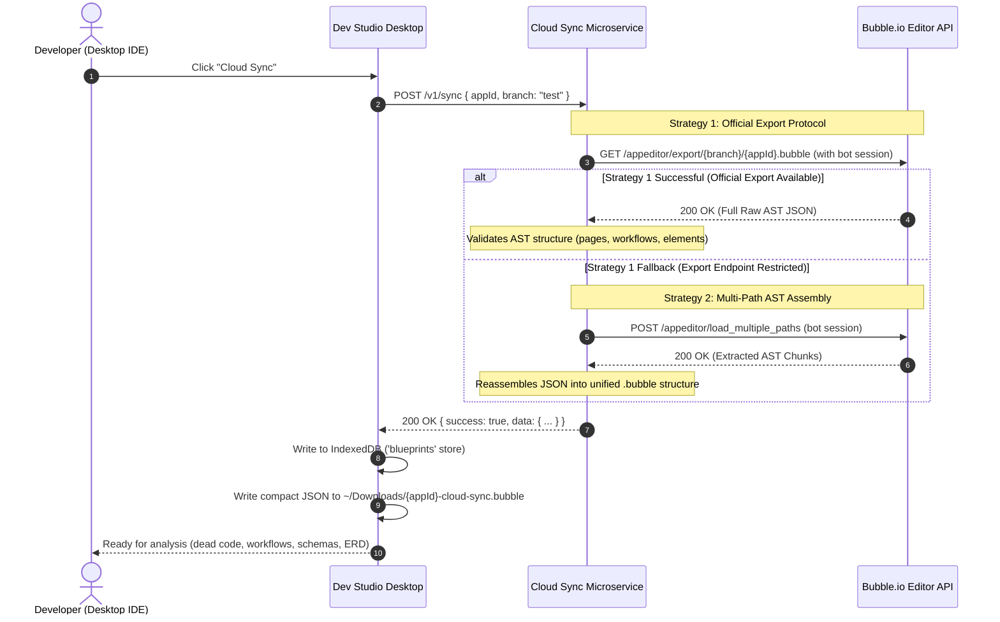

# Cloud Direct Sync Guide

Cloud Direct Sync fetches your Bubble application structure and Abstract Syntax Tree (AST) directly from the cloud using an authorized collaborator account.

---

## Overview

You can import your application blueprint in three ways:

```
┌────────────────────────────────────────────────────────────────────────────────────────┐
│                              Synchronization Options                                   │
├────────────────────────────────────────┬───────────────────────────────────────────────┤
│ Cloud Direct Sync                      │ Downloads Auto-Watcher                        │
│   • Uses collaborator account          │   • Background file watcher                   │
│   • Fetches directly inside the app    │   • Watches OS ~/Downloads                    │
│   • Returns full AST definition        │   • Works with manual exports                 │
└────────────────────────────────────────┴───────────────────────────────────────────────┘
```

---

## Setting up the Collaborator Account

### 1. Collaborator Address
The sync service uses the following service account:
```text
bubbledevstudio.bot@gmail.com
```

### 2. Setup in Bubble Editor
To enable Cloud Sync for your application:

1. Open your application in the **Bubble Editor**.
2. In the left navigation bar, open **Settings**.
3. Select the **Collaboration** tab.
4. Under **Invite an existing user to collaborate on this application**, enter:
   ```text
   bubbledevstudio.bot@gmail.com
   ```
5. Select collaboration rights (**View rights** are sufficient).
6. Click **Invite**.

> Note: Bubble requires a paid plan to add collaborators. If your app is on the Free plan, use the **Downloads Watcher** or **Manual File Import** instead.

---

## Running Cloud Sync

Once the collaborator account is invited:

1. In Bubble.io Dev Studio, click **Connect Application** (or open project settings).
2. Go to **Step 4: Blueprint & Schema Export File**.
3. Select **Cloud Direct Sync** and click **Sync Now**.
4. The service retrieves the app structure and delivers it to Dev Studio.
5. Dev Studio parses:
   - Pages and Reusable Elements
   - Workflows and Custom Events
   - UI elements and visual containers
   - Custom data types and Option Sets
   - App text keys
6. A backup copy is saved locally to:
   ```text
   ~/Downloads/[appId]-cloud-sync.bubble
   ```

---

## Technical Architecture & Extraction Strategy

The sync microservice uses a primary endpoint with a fallback:



### Strategy 1: Official Export Route (Primary)
- **Endpoint**: `https://bubble.io/appeditor/export/${branch}/${appId}.bubble`
- **Output**: Full AST containing elements, actions, workflows, states, and styles.
- **Fidelity**: Matches Bubble's manual export file.

### Strategy 2: Granular Path Assembly (Fallback)
- If the export route is unavailable or throttled, the service requests individual paths:
  - `pages`
  - `custom_types` / `user_types`
  - `option_sets`
  - `app_texts`
- The service normalizes these into standard `.bubble` blueprint JSON.

---

## File Storage

Exports are saved as compact JSON to `~/Downloads/[appId]-cloud-sync.bubble` (~10.8 MB for an average app), matching the format and size of Bubble's native export file.

---

## Security & Privacy

| Question | Policy | Details |
| :--- | :--- | :--- |
| **Are live database records accessed?** | No | Cloud Sync only accesses application definitions (UI, workflows, schemas). It does not query or read user data from your database. |
| **Where are bot credentials stored?** | Private server | The bot session cookie is kept in a private `.env` file on the server. It is never included in the Git repository or sent to desktop clients. |
| **Are API tokens or passwords exposed?** | No | Cloud Sync does not require your Bubble Data API token. API tokens configured in Dev Studio remain encrypted on your local machine using Electron `safeStorage`. |
| **Is the service rate-limited?** | Yes | Requests are limited to 30 requests per 15 minutes per IP address. |
| **How is transit secured?** | HTTPS / TLS | All requests route over HTTPS with TLS encryption. |
| **Can third parties access your app?** | No | Bubble allows only invited collaborators to access the editor. You can remove the collaborator account in Bubble Settings at any time. |

---

## Sync Method Comparison

| Feature | Cloud Direct Sync | Downloads Watcher | Manual Import |
| :--- | :---: | :---: | :---: |
| **Setup Time** | ~30 seconds (invite bot) | None | None |
| **Requires Bubble Paid Plan** | Yes (Collaboration feature) | No | No |
| **Manual Browser Export** | Not needed | 1 click in Bubble | 1 click in Bubble |
| **Automatic AST Refresh** | Yes | Yes (detected on download) | No (manual re-upload) |
| **Offline Operation** | No (requires internet) | Yes | Yes |
