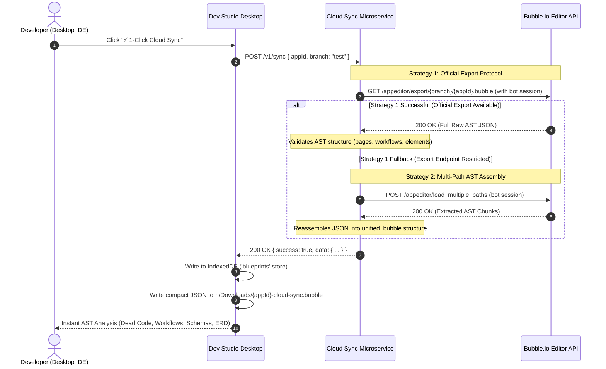

# ⚡ 1-Click Cloud Direct Sync & Collaborator Bot Guide (v3.3.9)

Bubble.io Dev Studio introduces **⚡ 1-Click Cloud Direct Sync**, an autonomous synchronization engine that pulls your entire Bubble application blueprint and Abstract Syntax Tree (AST) directly from the cloud without requiring manual downloads, browser devtools scraping, or local file hunting.

---

## 🌟 Overview: Why Cloud Direct Sync?

Traditionally, analyzing a Bubble application in an external IDE required developers to:
1. Navigate to Bubble Editor ➔ *Settings ➔ General*.
2. Scroll to *"Export application"* and click *Export*.
3. Wait for the browser to download a `.bubble` file.
4. Locate the file in their local `Downloads` directory and drag-and-drop it into the IDE.

With **Cloud Direct Sync**, Dev Studio connects directly to our dedicated Cloud Sync Microservice which acts as an authorized collaborator bot to fetch your application's AST in seconds.

```
┌────────────────────────────────────────────────────────────────────────────────────────┐
│                              Synchronization Topologies                                │
├────────────────────────────────────────┬───────────────────────────────────────────────┤
│ ⚡ 1-Click Cloud Sync                  │ 📁 Downloads Auto-Watcher                     │
│   • Autonomous Collaborator Bot        │   • Background File Watcher                   │
│   • Zero File Hunting & Zero Friction  │   • Listens to OS ~/Downloads                 │
│   • 100% Full AST Fidelity             │   • Zero Setup Required                       │
└────────────────────────────────────────┴───────────────────────────────────────────────┘
```

---

## 🤖 How the Collaborator Bot Works

### 1. The Official Collaborator Bot
The studio operates an official, secure service account:
```text
bubbledevstudio.bot@gmail.com
```

### 2. Step-by-Step Setup in Bubble Editor (Takes 30 Seconds)
To enable 1-Click Cloud Sync for any Bubble application:

1. Open your application in the **Bubble Editor**.
2. In the left navigation bar, click on **Settings (⚙️)**.
3. Select the **Collaboration** tab.
4. Under **"Invite an existing user to collaborate on this application"**, enter:
   ```text
   bubbledevstudio.bot@gmail.com
   ```
5. Choose collaboration rights (**View rights** or **Edit rights**).
6. Click **Invite**.

> [!NOTE]
> Collaboration requires a Bubble plan with collaborator support. If your app is on the Free plan, you can use **Method 1: Local Auto-Detect (Downloads Watcher)** or **Manual File Import**, both of which work 100% free with zero plan restrictions.

---

## 🚀 Triggering Cloud Sync in Dev Studio

Once the bot is invited to your app:

1. In Bubble.io Dev Studio, click **Connect Application** (or open project settings).
2. Follow the wizard to **Step 4: Blueprint & Schema Export File**.
3. Under **Method 2: Cloud Direct Sync**, click:
   ```text
   ⚡ 1-Click Cloud Sync
   ```
4. Dev Studio communicates securely with the Cloud Sync Microservice.
5. The microservice retrieves your app structure and delivers it to Dev Studio.
6. The app is automatically parsed:
   - **Pages & Reusable Elements**
   - **Workflows & Custom Events**
   - **UI Elements & Containers**
   - **Custom Data Types & Option Sets**
   - **App Texts & Translation Keys**
7. A local compact backup file is automatically saved to:
   ```text
   ~/Downloads/[appId]-cloud-sync.bubble
   ```
   and highlighted in your operating system's file manager.

---

## 🔬 Technical Architecture & Dual-Protocol Strategy

The Cloud Sync Microservice (`server/bubble-cloud-sync`) uses an intelligent dual-protocol strategy to ensure 100% data fidelity:



### Strategy 1: Official Bubble Export Protocol (Priority)
- **Endpoint**: `https://bubble.io/appeditor/export/${branch}/${appId}.bubble`
- **Session Header**: Bot authentication cookie `bubble_session`.
- **Output**: 100% complete AST containing all elements, actions, workflows, states, and styles.
- **Fidelity**: Exact match to Bubble's native manual export.

### Strategy 2: `/appeditor/load_multiple_paths` Fallback
- If the export route is temporarily throttled or unavailable, the microservice falls back to loading core AST paths:
  - `pages`
  - `custom_types` / `user_types`
  - `option_sets`
  - `app_texts`
- The service normalizes these into standard `.bubble` blueprint JSON.

---

## 💾 Compact Storage & File Size Optimization

Previous exports formatted with pretty-printed JSON (`null, 2`) occupied **~29.4 MB** for large applications. In `v3.3.8`:
- The desktop engine writes compact, unpadded JSON (`JSON.stringify(data)`).
- The resulting file size is **10.8 MB**, matching Bubble's official export byte-for-byte.
- Files are named cleanly:
  ```text
  [appId]-cloud-sync.bubble
  ```
  (e.g., `quiz2coin-search-test-cloud-sync.bubble`).

---

## 🛡️ Security & Privacy Guarantees

We take data privacy and intellectual property very seriously:

| Security Question | Guarantee | Implementation |
| :--- | :--- | :--- |
| **Are live database records accessed?** | 🚫 **NO** | Cloud Sync **ONLY** accesses application structure (AST: UI, workflows, schemas). It **never** reads, queries, or transfers live user records or personal data from the Bubble database. |
| **Where are bot credentials stored?** | 🔒 **Isolated on VM** | The bot session cookie (`BUBBLE_BOT_SESSION`) is stored exclusively in a secure `.env` file on our private, hardened Linux VM. It is never included in the Git repository and never exposed to the client. |
| **Are API tokens or passwords exposed?** | 🚫 **NO** | Cloud Sync does not require your Bubble Data API token or admin passwords. All API tokens entered in Dev Studio remain encrypted on your local machine using Node.js/Electron safeStorage. |
| **Is the microservice rate-limited?** | 🛡️ **YES** | The service enforces an IP-based sliding window rate limiter: **maximum 30 requests per 15 minutes** per IP address to prevent abuse. |
| **How is network transit protected?** | 🔒 **HTTPS Edge Gateway** | All traffic from desktop clients is routed through a secure HTTPS edge gateway (`https://bubble-cloud-sync-mtlg-dev.vercel.app`) with 120s streaming support, shielding origin server infrastructure and encrypting all payloads in transit with TLS 1.3. |
| **Can third parties access my app?** | 🔒 **NO** | Bubble's authorization model strictly ensures that only invited collaborators can access the app editor. If the bot is not invited, Bubble returns HTTP 403 / 404. You can remove the bot collaborator anytime in Bubble Settings. |

---

## 📊 Comparison of Sync Methods

| Capability | ⚡ 1-Click Cloud Sync | 📁 Downloads Auto-Watcher | 📄 Manual Import |
| :--- | :---: | :---: | :---: |
| **Setup Time** | 30 seconds (invite bot) | 0 seconds (zero setup) | 0 seconds |
| **Requires Bubble Paid Plan** | Yes (Collaboration feature) | No (Works on Free plan) | No (Works on Free plan) |
| **Manual Export in Browser** | ❌ Not needed | ⚠️ 1-click in Bubble | ⚠️ 1-click in Bubble |
| **Automatic AST Refresh** | ✅ Instant (1-Click) | ✅ Auto-caught on export | ❌ Manual re-upload |
| **Works Completely Offline** | No (Requires internet) | Yes (Local filesystem) | Yes (Local filesystem) |
