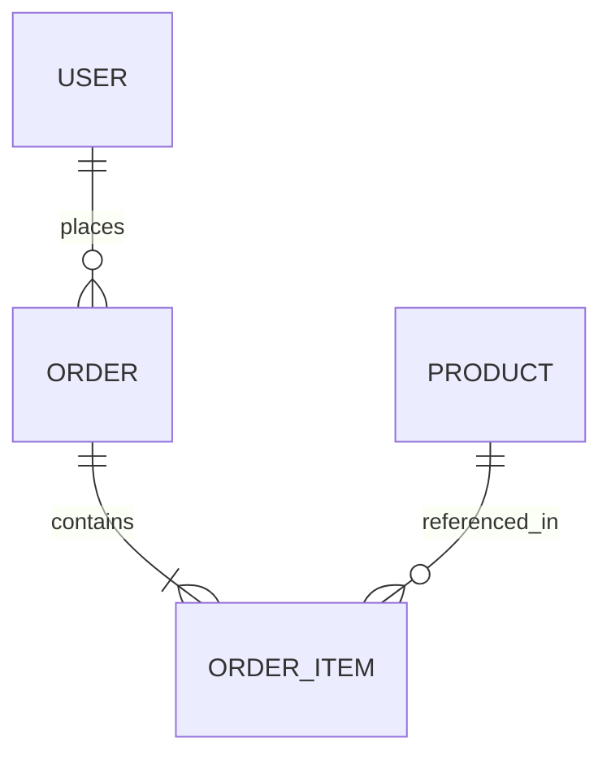

# 🛠️ DevOps & Database Studio Guide

The **DevOps & Database Studio** is an enterprise-grade toolchain for managing Bubble.io database schemas, live records, TypeScript bindings, automated backups, and environment releases.

---

## 🌟 2-Tier Structured Architecture

To provide a clean, distraction-free workflow, the module is organized into **4 Focused Core Domains**:

```
┌────────────────────────────────────────────────────────────────────────────────────────┐
│                              DevOps & Database Studio                                  │
├────────────────────┬────────────────────┬────────────────────┬─────────────────────────┤
│ 📊 Data Studio     │ 📑 Schema & Flow   │ 💾 Backups & DevOps│ 🛠️ Dev Tools & CI/CD   │
│   • Live Data Grid │   • Schema Explorer│   • Backup & Restore│   • CI/CD Pipelines    │
│   • REPL Query     │   • ERD Diagram    │   • Snapshots DB   │   • SQL / DB Export     │
│   • Relational Seed│   • Flowchart Map  │   • Schema Migrates│   • Mock API Server     │
│                    │   • TypeScript d.ts│   • Dev vs Live    │   • Workflow Trigger    │
│                    │   • PII Privacy    │                    │                         │
└────────────────────┴────────────────────┴────────────────────┴─────────────────────────┘
```

---

## 1. Domain 1: Data Studio (`Data & Records`)

### 📊 Interactive Data Studio (Live Spreadsheet Grid)
* **Live CRUD Explorer**: Direct integration with Bubble's Data API (`/api/1.1/obj/[table]`).
* **📥 Smart CSV & JSON Batch Importer**: Upload `.csv` (RFC 4180) or `.json` (array of objects) files with automated column mapping, type casting (`number`, `boolean`, `text`), live progress tracking, and batch creation.
* **📖 Interactive In-App Template Guides**: Preview and copy ready-to-use CSV and JSON templates matching your selected table schema with 1-click `Download CSV` / `Download JSON` buttons.
* **Inline Cell Editing**: Double-click any cell or click the pencil icon to update fields in real-time (`PATCH`).
* **New Record Creation**: Modal with schema-validated input types (`text`, `number`, `boolean`, `date`).
* **Multi-Column Sorting & Filtering**: Instant text search and column sort indicators.
* **Auto Exposure Warning**: If a table is not exposed under Bubble *Settings ➔ API ➔ Data API*, the studio automatically detects HTTP 404 and provides a 1-click checklist with Bubble settings deep-links.
* **CSV Export**: Export filtered or selected rows to RFC 4180 CSV files.

### ⚡ Live REPL & Query
* Execute instant filter tests and complex constraint queries (`equals`, `contains`, `greater than`, `is_empty`) with immediate visual output.

### 🌱 Relational Data Seeder & DAG Resolver
* **Cross-Table Foreign Key Linking**: Define parent records using `"_ref": "@alias"` and reference them anywhere in child tables (e.g. `"owner": "@user_admin"`, `"members": ["@user_1", "@user_2"]`).
* **Automatic DAG Resolution**: Topologically sorts tables by dependency hierarchy, creates parents first, captures real Bubble `_id`s, and replaces `@alias` references with real IDs before creating dependent children.
* **2-Pass Deferred Resolution for Circular References**: Automatically detects circular dependencies and schedules deferred `PATCH` requests.
* **Preflight Schema Validator**: Checks seed definitions against active Bubble schema, flagging missing tables, unmapped fields, or type mismatches.
* **Dynamic Template Generator**: 1-click generation of multi-table relational templates directly from the active project schema or sample interconnected suites.

---

## 2. Domain 2: Schema & Flow (`Architecture & Types`)

### 📑 Schema Explorer
* Inspect custom data types, fields, nullability, list relations, and Option Sets.

### 🕸️ Visual Mermaid ERD Diagram
* Automatically generates entity-relationship diagrams illustrating foreign key relationships between tables:



### 🔀 Workflow Flowchart Map
* Interactive DAG node graph displaying workflow triggers, actions, database writes, and condition branches (`Only when...`).

### 🏷️ TypeScript Definitions Generator (`.d.ts`)
* Generates strict, type-safe interfaces for Bubble plugins, external microservices, and scripts:

```typescript
export interface BubbleUser {
  _id: string;
  'Created Date': string;
  'Modified Date': string;
  email: string;
  role: 'Admin' | 'Member' | 'Guest';
  orders?: string[];
}
```

### 🛡️ PII & Privacy Scanner
* Scans table schemas for sensitive credentials, emails, phone numbers, and Stripe customer tokens.

---

## 3. Domain 3: Backups & DevOps (`Reliability & Migrations`)

### 💾 Backup & Restore (Archival Hub)
* Run full or incremental database backups with optional **AES-256-GCM encryption** and cloud destination uploads.
* Instant access to backup history with row counts, file sizes, and 1-click restore/download.

### 📸 Database Snapshots & 1-Click Rollback
* Save point-in-time table states into local IndexedDB before running risky operations.
* Run visual differential comparisons (Added 🟢, Modified 🟡, Deleted 🔴) and rollback with 1-click.

### 📜 Schema Migrations (Schema-as-Code)
* Compare current schema against baseline lockfiles (`schema.lock.json`) and generate declarative migration operations (`ADD_FIELD`, `CHANGE_TYPE`).

### 🔄 Dev vs Live Sync
* Compare table schemas between `version-test` and `version-live` to prevent schema drift during deployment.

---

## 4. Domain 4: Dev Tools & CI/CD (`Tooling & Automation`)

### 🚀 CI/CD Pipelines
* Generate production-ready GitHub Actions (`.github/workflows/bubble-devops.yml`) and GitLab CI configurations.

### 📤 SQL / DB Exporter
* Generate DDL and seed scripts for PostgreSQL, SQLite, and Google BigQuery.

### 🔌 Mock API Server
* Built-in HTTP emulator for testing frontend and webhook integrations without consuming live Bubble workload units.

### ⚡ Workflow Trigger
* Trigger backend Bubble workflows (`/api/1.1/wf/[workflow_name]`) with custom JSON payloads.
