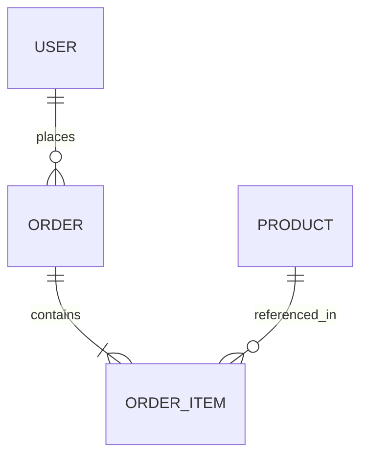

# 🛠️ DevOps & Database Studio Guide

The **DevOps & Database Studio** is a complete toolchain for managing Bubble.io database schemas, live records, TypeScript bindings, and environment releases.

---

## 1. Interactive Data Studio (Live CRUD Explorer)

The **Interactive Data Studio** provides an Airtable / Supabase-style table for interacting directly with Bubble's Data API.

### Key Capabilities:
1. **Table Switcher**: Quickly switch between all custom tables (`User`, `Order`, `Product`, etc.).
2. **Inline Cell Editing**: Double-click any table cell or click the pencil icon to modify values in real-time. Changes are immediately synced to the Bubble backend via `PATCH /api/1.1/obj/[type]/[id]`.
3. **New Record Creation**: Click **"+ New Record"** to open a schema-driven modal form with auto-detected input types (`text`, `number`, `boolean`, `date`).
4. **Search & Multi-Column Sorting**: Filter rows instantly by text search or click column headers to sort ascending/descending.
5. **CSV & JSON Export**: Export selected rows or the entire dataset to standard RFC 4180 CSV files.

---

## 2. Schema Explorer & Mermaid ERD Visualizer

* **Schema Inspector**: Inspect all data types, custom fields, data types (`text`, `number`, `date`, `list`, `custom_type`), and global Option Sets.
* **Mermaid ERD Diagram**: Automatically generates visual entity-relationship diagrams illustrating foreign key relationships between tables.



---

## 3. TypeScript Definition Generator (`.d.ts`)

Converts Bubble data types into clean, strict TypeScript interfaces for plugin developers, frontend clients, and external backend microservices:

```typescript
export interface BubbleUser {
  _id: string;
  'Created Date': string;
  'Modified Date': string;
  email: string;
  first_name?: string;
  last_name?: string;
  role: 'Admin' | 'Member' | 'Guest';
  orders?: string[];
}
```

---

## 4. Point-in-Time Database Snapshots & 1-Click Rollback

Protect your development environment before performing high-risk data seedings or schema migrations.

### How to use Snapshots:
1. Navigate to the **Snapshots & Rollback** subtab.
2. Select your target data type and click **"Capture Snapshot"**. The records are instantly stored in IndexedDB.
3. Perform your data operations, seedings, or tests.
4. Select your **Baseline Snapshot** and **Target State**, then click **"Run Diff"**.
5. The differential viewer highlights:
   - 🟢 **Added records** (new uncommitted entries)
   - 🟡 **Modified records** with old vs new field-level values
   - 🔴 **Deleted records** that need recreation
6. Click **"1-Click Rollback to Baseline"** to automatically restore all records to their exact previous state.

---

## 5. Automated Backups & Environment Sync

* **Quick Backup**: Export all table records to JSON / CSV with timestamped archival.
* **Dev vs Live Sync**: Compare table definitions between `version-test` and `version-live` to detect schema drifts before deployment.
