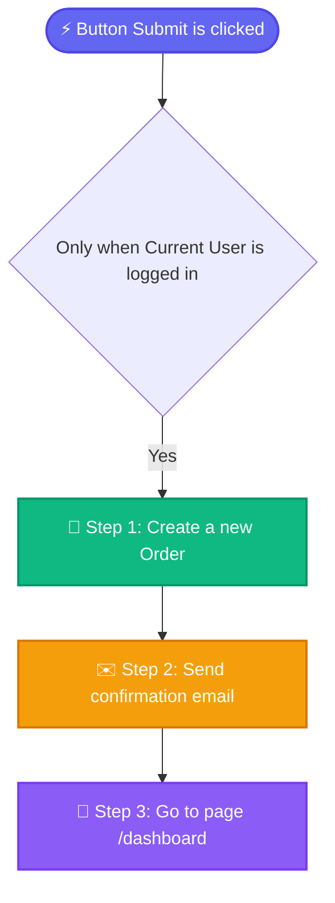

# 🔀 Visual Workflow Flowchart & Logic Guide (v3.0.0)

The **Visual Workflow Flowchart** module parses raw Bubble action chains into interactive node graphs, illustrating execution sequences, conditional branches, and potential performance bottlenecks.

---

## 1. Flowchart Node Hierarchy

Workflows in Bubble execute sequentially. The engine classifies each step into color-coded functional node types:

### Supported Node Types:
* ⚡ **Trigger Node (Indigo)**: Click events, input value changes, page load events, or API endpoint invocations.
* 💾 **Database Write (Emerald)**: `Create a new thing`, `Make changes to thing`, `Delete thing`, `Set list`.
* ✉️ **Email Dispatch (Amber)**: `Send email`, `Send email with Sendgrid/Postmark template`.
* 🌐 **API Call (Cyan)**: API Connector calls, webhook dispatches, external HTTP requests.
* 🚀 **Navigation & UI (Purple)**: `Go to page`, `Show element`, `Hide element`, `Toggle popup`.
* ⚙️ **Custom Event / Plugin Action (Slate)**: Custom internal events and third-party plugin executions.

---

## 2. Performance & Bottleneck Diagnostics

The workflow analyzer inspects action sequences for Bubble best-practice anti-patterns:

1. **Client-Blocking Synchronous Emails**:
   - *Issue*: Triggering `Send email` directly in a page workflow freezes the browser UI until the SMTP handshake finishes.
   - *Recommendation*: Schedule the email via `Schedule API Workflow` on the server backend.
2. **Heavy Multi-Step Workflows**:
   - *Issue*: Workflows containing > 5 sequential operations on the client lead to laggy user interactions.
   - *Recommendation*: Encapsulate data modifications into a single Backend API Workflow.
3. **Unconstrained Nested Searches**:
   - *Issue*: Using `Do a search for` inside action parameters without pagination or filters multiplies Workload Units (WU).

---

## 3. Mermaid Diagram Export

Click **"Copy Diagram"** to copy the GitHub-Flavored Mermaid flowchart code directly into your team's technical documentation or pull requests.
