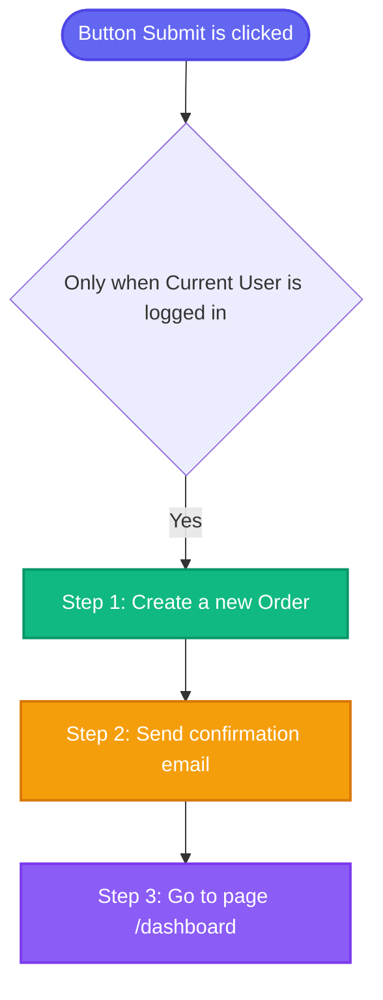

# Workflow Flowchart & Logic Guide

The Workflow Flowchart module renders Bubble action chains as node graphs, showing execution order, conditional branches, and potential performance bottlenecks.

---

## 1. Flowchart Node Hierarchy

Workflows in Bubble execute in sequence. The engine classifies steps into node types:

### Supported Node Types
* **Trigger Node**: Click events, input value changes, page loads, or API endpoint invocations.
* **Database Write**: `Create a new thing`, `Make changes to thing`, `Delete thing`, or `Set list`.
* **Email Dispatch**: Standard email actions or third-party template dispatches.
* **API Call**: Bubble API Connector requests, webhooks, and HTTP calls.
* **Navigation & UI**: `Go to page`, `Show element`, `Hide element`, or `Toggle popup`.
* **Custom Event / Plugin**: Internal custom events and plugin actions.

---

## 2. Action Inspection Drawer

Clicking any node opens a side drawer to inspect:
* Target element name, action category, and execution index.
* Action parameters, dynamic expressions, and field mappings.
* `"Only when..."` conditional expressions.

---

## 3. Performance & Bottleneck Diagnostics

The workflow analyzer checks for common anti-patterns:

1. **Synchronous Frontend Emails**:
   - *Problem*: Triggering `Send email` in a page workflow pauses UI interactions until the SMTP request completes.
   - *Recommendation*: Use `Schedule API Workflow` to send emails in the background on the server.
2. **Heavy Multi-Step Workflows**:
   - *Problem*: Workflows containing many sequential operations on the client can cause laggy page responses.
   - *Recommendation*: Move multi-step data mutations into a single Backend API Workflow.
3. **Unconstrained Nested Searches**:
   - *Problem*: Using `Do a search for` inside action parameters without limits or filters increases Workload Units (WU).
   - *Recommendation*: Constrain searches to indexed fields and paginate results.

---

## 4. Mermaid Diagram Export

Click **Copy Diagram** to export the Mermaid flowchart syntax for pull requests, wikis, or project documentation.
